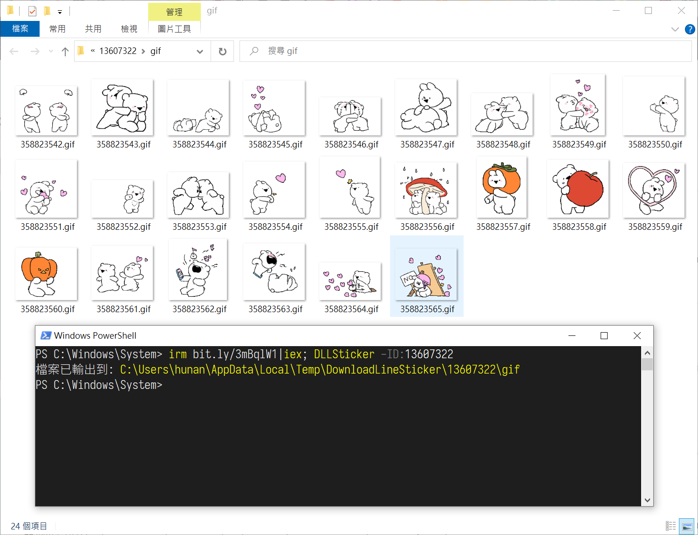

Line動態GIF貼圖下載
===

下載啟動捷徑到桌面 (啟動後直接輸入號碼即可)
```ps1
irm bit.ly/3mBqlW1|iex; Download_DLLSticker
```

<br><br>

## Line動態GIF貼圖下載
範例貼圖網址：https://store.line.me/stickershop/product/13607322/zh-Hant?ref=Desktop  

從貼圖舖的網址中取出網址中的ID，上述例子的話是 13607322 的數字。  

```ps1
# 下載到暫存資料夾並自動打開資料夾
irm bit.ly/3mBqlW1|iex; DLLSticker -ID:13607322

# 下載到指定位置 (-Explore: 完成後打開資料夾)
irm bit.ly/3mBqlW1|iex; DLLSticker 13607322 'D:\Line動態貼圖\13607322' -Explore

```




<br><br><br>

## 其他
捷徑的項目位置
```ps1
powershell -Nop -C "$ID=(Read-Host '輸入Line貼圖網址中數字的代碼'); irm bit.ly/3mBqlW1|iex; DLLSticker -ID:$ID"
```
