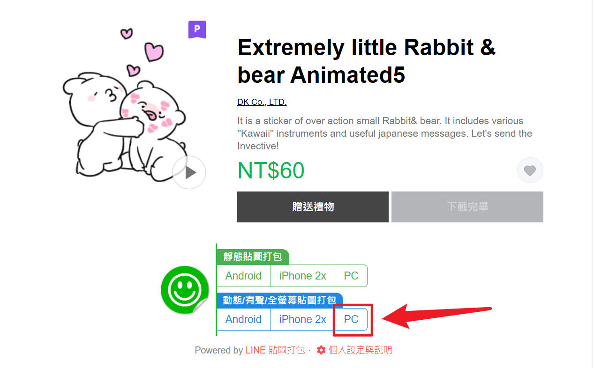

Line貼圖轉PNG轉GIF
===

## Line貼圖下載
1. 安裝Chrome套件  
https://chrome.google.com/webstore/detail/stickers-packer/bngfikljchleddkelnfgohdfcobkggin

2. 下載商店貼圖  
https://store.line.me/stickershop/product/13607322/?ref=Desktop




## 使用方法

- animation : png圖片路徑
- gif       : 轉換後的gif路徑

```ps1
# 用法1 (Powershell 5 下不支援相對路徑)
irm bit.ly/3KUdrvH|iex; cvApng2Gif 'D:\animation' 'D\gif'

# 用法2 (會自動在路徑內產生一個gif資料夾)
irm bit.ly/3KUdrvH|iex; cvApng2Gif 'D:\animation'

```
